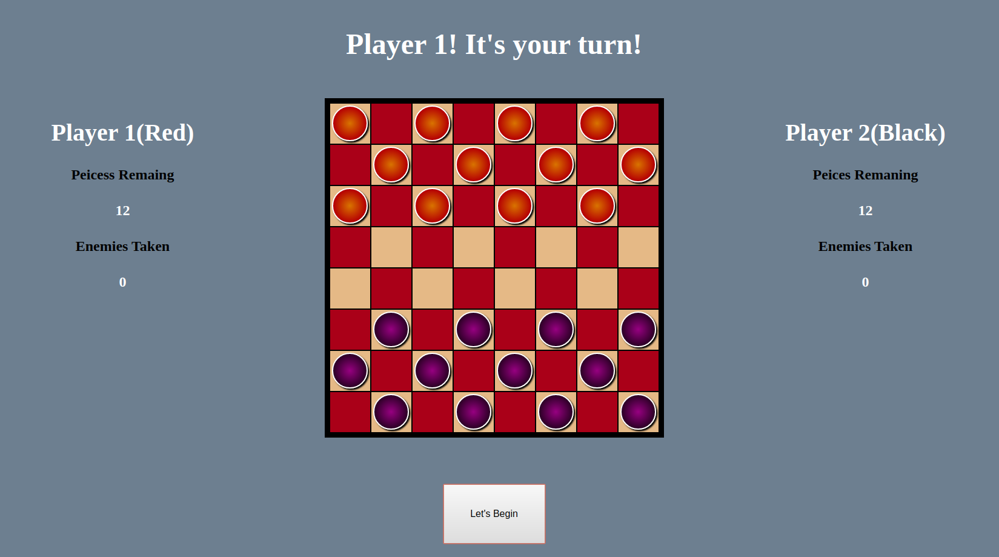

# Checkers




This is a simple version of checkers using just HTML,CSS, and Javascript to write the whole project.

https://ryan-finch.github.io/Checkers/ Here is a playable version.

Things to know when getting started, press the begin button to set the board and scores. Red always goes first. All mechanics of checkers are avaible except for double jumps. But get to teh end and you will be kinged and can move in all directions after that. Winner is declared when all pieces from the opposing side have been taken.


Eventual plans will be to add the double jump method, add some more visual effects to the game and implement AI for one player play.


``` 
PseudoCode

Start with defining known constants that I will be using
-create an array for board indexing and positioning
-create an array/objects for red and black checkers to apply attributes for  friend/foe, positioning, and wether its been kinged or not

Define all known variable I will be using
-set the piece count for both sides, to act as the counter for winning
-set player1 and player2 variables
-set pieces taken for both teams to 0, for incrementing for know "score" for each sides
-set winner variable, to signify when a player has taken all of teh other teams pieces

Set cached elements I will need for referecing
-creat cache for both the board squares and both sets of red/black checkers

Setup known event listeners that will be used/needed
-create event listenenrs for selecting each checker and for square selection for moving
-create event listener for a replay buttong to reset board


Begin to create known functions
-start with creating a init() to initailize the board and all set that need o be reset each playthrough
    -this includes board indexing(running array throug a loop with cached squares), and positioning pieces through the arrays/objects defined and setting all scores and piece counts to inital values. creating functions as needed to reset all variables

-beging to set up render functions and the corresponding functions needed to updating the apps states
    -this will include,  updating positons of checkers based on moves made by using the event listeners and matching postions index with board and pieces. Checking for winner or informing who is next with a If Else statement, via messages (should be no ties only winner and loser)

-event clickers should involve selecting piece, and using a loops to go through the board for possible open spots, if taken spot are friend or foe, and if there is a  possibility for a battle(jump) and then if after that there is the opportunity for a double jump.(this can be done by setting attributes for occupied(true/false) and friend or foe attribute of checkers) updates counters as needed for for rendering the board like any pieces taken/pieces left. Should also see if the winner has been decidede before allowing another click to be made.

-eventlisteners may need to be nested to allow for proper selecting of checker and then square for moving and battling
-eventlisteners should also update the vaule of player turn varialble for rendering.

-render board again and wait for next move to be made or display winner if it has been achieved!

```
